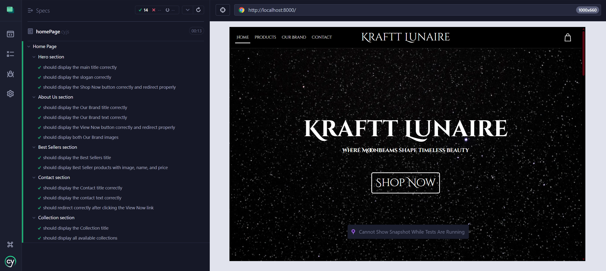

# cypressKrafttLunaire
End-to-end UI tests using Cypress for the home page of Kraftt Lunaire, a jewelry brand website.

Ce projet comprend une suite de tests end-to-end écrits avec [Cypress](https://www.cypress.io/) pour vérifier le bon fonctionnement de différentes sections d'une page d'accueil e-commerce.

## ✅ Tous les tests passent



## Objectif

L'objectif est de tester l'affichage et la navigation des sections suivantes du site :

- **Hero**
- **About Us**
- **Best Sellers**
- **Collection**
- **Contact**

## Outils utilisés

- Cypress 12.x
- JavaScript (ES6)
- HTML / CSS

## Convention adoptée : utilisation stricte de `data-cy`

Tous les tests utilisent **exclusivement des attributs `data-cy`** pour cibler les éléments HTML.

### Pourquoi ce choix ?

- 🔒 **Séparation claire entre code et tests** : les sélecteurs `data-cy` ne sont pas liés au style ou au comportement de l'application.
- ⚙️ **Résilience aux changements** : contrairement aux `id` ou aux `class`, les `data-cy` ne changent pas sauf en cas de modification volontaire des tests.
- 🔍 **Lisibilité et maintenabilité** : ils permettent d’écrire des tests compréhensibles et robustes.

**Exemple d’utilisation :**
```html
<button data-cy="btnShop">Shop Now</button>
```
## Défi rencontré : le composant Swiper

L'un des défis rencontrés lors de l'écriture des tests a été lié à la **section Best Sellers**, qui utilise un **slider Swiper**. Par défaut, Swiper masque les éléments non actifs (`overflow: hidden`), ce qui empêche Cypress de les détecter comme visibles.

### Problème :

Timed out retrying after 4000ms: expected '' to be 'visible'
